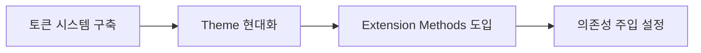
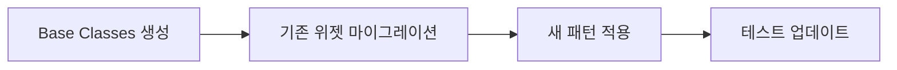
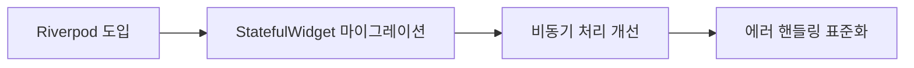
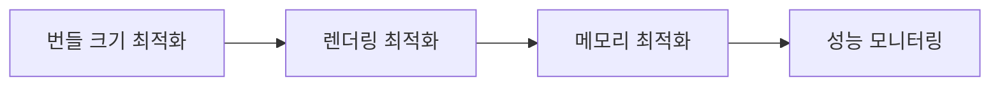

# ⚡ 코드 현대화 기회 분석

## 🎯 현대화 목표

LIA 프로젝트의 코드를 최신 Flutter/Dart 패턴과 베스트 프랙티스에 맞춰 현대화하여 성능, 유지보수성, 개발 효율성을 향상시킵니다.

## 📊 현재 코드 분석 결과

### 🔍 발견된 개선 기회들

#### 1. 🎨 색상 관리 현대화
**현재 상태:**
```dart
// AppColors.dart - 중복 정의 문제
static const Color charcoal = Color(0xFF333333);
static const Color primaryText = Color(0xFF333333);  // 중복!
static const Color textPrimary = Color(0xFF333333);  // 중복!
```

**현대화 방안:**
```dart
// 의미 기반 토큰 시스템 도입
class AppTokens {
  // 색상 토큰
  static const _ColorTokens colors = _ColorTokens();
  
  // 스페이싱 토큰  
  static const _SpacingTokens spacing = _SpacingTokens();
  
  // 타이포그래피 토큰
  static const _TypographyTokens typography = _TypographyTokens();
}

class _ColorTokens {
  // 시맨틱 컬러 시스템
  const _ColorTokens();
  
  // 브랜드 컬러
  Color get primary => const Color(0xFFFF70A6);
  Color get secondary => const Color(0xFFA162F7);
  
  // 시맨틱 컬러  
  Color get textPrimary => const Color(0xFF333333);
  Color get textSecondary => const Color(0xFF555555);
  Color get surface => const Color(0xFFFFFFFF);
  Color get background => const Color(0xFFFFF8FB);
  
  // 상태 컬러
  Color get success => const Color(0xFF28a745);
  Color get error => const Color(0xFFDC3545);
  Color get warning => const Color(0xFFFFC107);
  Color get info => const Color(0xFF17A2B8);
}
```

#### 2. 🔧 위젯 생성 패턴 현대화
**현재 상태:**
```dart
// 기존 - 장황한 위젯 생성
Container(
  padding: const EdgeInsets.all(16),
  decoration: BoxDecoration(
    color: AppColors.surface,
    borderRadius: BorderRadius.circular(12),
    border: Border.all(
      color: AppColors.primary.withValues(alpha: 0.2),
      width: 1,
    ),
  ),
  child: /* content */,
)
```

**현대화 방안:**
```dart
// Extension Methods 활용
extension WidgetExtensions on Widget {
  Widget cardStyle({
    EdgeInsets? padding,
    Color? backgroundColor,
    double borderRadius = 12,
  }) {
    return Container(
      padding: padding ?? AppTokens.spacing.md,
      decoration: BoxDecoration(
        color: backgroundColor ?? AppTokens.colors.surface,
        borderRadius: BorderRadius.circular(borderRadius),
        border: Border.all(
          color: AppTokens.colors.primary.withOpacity(0.2),
          width: 1,
        ),
      ),
      child: this,
    );
  }
  
  Widget responsive({
    Widget? mobile,
    Widget? tablet, 
    Widget? desktop,
  }) {
    return LayoutBuilder(
      builder: (context, constraints) {
        if (constraints.maxWidth >= 1200 && desktop != null) {
          return desktop;
        } else if (constraints.maxWidth >= 768 && tablet != null) {
          return tablet;
        }
        return mobile ?? this;
      },
    );
  }
}

// 사용법
Text('내용').cardStyle()
```

#### 3. 📱 상태 관리 현대화
**현재 상태 (예상):**
```dart
// 기존 - StatefulWidget 과다 사용
class MyScreen extends StatefulWidget {
  @override
  _MyScreenState createState() => _MyScreenState();
}

class _MyScreenState extends State<MyScreen> {
  bool _isLoading = false;
  String _data = '';
  
  void _loadData() async {
    setState(() { _isLoading = true; });
    // 비즈니스 로직...
    setState(() { _isLoading = false; });
  }
}
```

**현대화 방안:**
```dart
// Riverpod/BLoC 패턴 도입
@riverpod
class ScreenNotifier extends _$ScreenNotifier {
  @override
  AsyncValue<ScreenState> build() {
    return const AsyncValue.loading();
  }
  
  Future<void> loadData() async {
    state = const AsyncValue.loading();
    
    try {
      final result = await _repository.fetchData();
      state = AsyncValue.data(ScreenState(data: result));
    } catch (error, stackTrace) {
      state = AsyncValue.error(error, stackTrace);
    }
  }
}

// Widget에서 사용
class MyScreen extends ConsumerWidget {
  @override
  Widget build(BuildContext context, WidgetRef ref) {
    final screenState = ref.watch(screenNotifierProvider);
    
    return screenState.when(
      loading: () => const LoadingWidget(),
      error: (error, _) => ErrorWidget(error.toString()),
      data: (state) => ContentWidget(state.data),
    );
  }
}
```

#### 4. 🎯 의존성 주입 현대화
**현재 상태 (예상):**
```dart
// 기존 - 하드코딩된 의존성
class AnalysisScreen extends StatefulWidget {
  @override
  _AnalysisScreenState createState() => _AnalysisScreenState();
}

class _AnalysisScreenState extends State<AnalysisScreen> {
  final AnalysisDataService _service = AnalysisDataService(); // 하드코딩
  
  void _analyze() {
    _service.analyzeData(); // 직접 호출
  }
}
```

**현대화 방안:**
```dart
// GetIt + Injectable 또는 Riverpod 의존성 주입
@riverpod
AnalysisDataService analysisDataService(AnalysisDataServiceRef ref) {
  return AnalysisDataService(
    apiClient: ref.read(apiClientProvider),
    storage: ref.read(storageProvider),
  );
}

@riverpod
class AnalysisNotifier extends _$AnalysisNotifier {
  @override
  AsyncValue<AnalysisResult> build() => const AsyncValue.loading();
  
  Future<void> analyzeData(String input) async {
    final service = ref.read(analysisDataServiceProvider);
    state = const AsyncValue.loading();
    
    try {
      final result = await service.analyzeData(input);
      state = AsyncValue.data(result);
    } catch (error, stackTrace) {
      state = AsyncValue.error(error, stackTrace);
    }
  }
}
```

#### 5. 🔄 비동기 처리 현대화
**현재 상태:**
```dart
// 기존 - 기본적인 Future 사용
Future<void> _loadData() async {
  try {
    setState(() { _isLoading = true; });
    final result = await _service.fetchData();
    setState(() { 
      _data = result;
      _isLoading = false; 
    });
  } catch (e) {
    setState(() { 
      _error = e.toString();
      _isLoading = false; 
    });
  }
}
```

**현대화 방안:**
```dart
// Stream/AsyncValue 활용한 반응형 프로그래밍
@riverpod
class DataNotifier extends _$DataNotifier {
  @override
  Stream<DataState> build() {
    return _repository.dataStream.map((data) => DataState.loaded(data));
  }
  
  Future<void> refreshData() async {
    // 자동으로 상태 관리
    state = const AsyncValue.loading();
    await _repository.refreshData();
  }
}

// 또는 RxDart 활용
class DataController {
  final _dataSubject = BehaviorSubject<DataState>();
  Stream<DataState> get dataStream => _dataSubject.stream;
  
  void loadData() {
    _repository.fetchData()
      .asStream()
      .map((data) => DataState.loaded(data))
      .handleError((error) => DataState.error(error))
      .listen(_dataSubject.add);
  }
}
```

#### 6. 🎨 테마 시스템 현대화
**현재 상태:**
```dart
// 기존 - 개별 스타일 적용
Text(
  'Title',
  style: TextStyle(
    fontFamily: 'Pretendard',
    fontSize: 18,
    fontWeight: FontWeight.w700,
    color: AppColors.charcoal,
  ),
)
```

**현대화 방안:**
```dart
// Material 3 Design System 도입
class AppTheme {
  static ThemeData lightTheme = ThemeData(
    useMaterial3: true,
    colorScheme: ColorScheme.fromSeed(
      seedColor: AppTokens.colors.primary,
      brightness: Brightness.light,
    ),
    textTheme: _textTheme,
    elevatedButtonTheme: _elevatedButtonTheme,
    cardTheme: _cardTheme,
  );
  
  static const TextTheme _textTheme = TextTheme(
    displayLarge: TextStyle(fontFamily: 'Gaegu'),
    headlineLarge: TextStyle(fontFamily: 'Pretendard'),
    bodyLarge: TextStyle(fontFamily: 'NotoSansKR'),
  );
}

// 사용법 - 컨텍스트 기반 스타일
Text('Title', style: context.theme.textTheme.headlineLarge)
```

#### 7. 🧪 테스트 현대화
**현재 상태 (예상):**
```dart
// 기존 - 기본적인 위젯 테스트
testWidgets('should render widget', (tester) async {
  await tester.pumpWidget(MyWidget());
  expect(find.text('Hello'), findsOneWidget);
});
```

**현대화 방안:**
```dart
// 통합된 테스트 스위트
class WidgetTestSuite {
  static Future<void> runStandardTests<T extends Widget>(
    String description,
    T Function() widgetBuilder, {
    Map<String, dynamic>? testData,
    List<AccessibilityTest>? a11yTests,
    List<GoldenTest>? goldenTests,
  }) async {
    group(description, () {
      testWidgets('renders without errors', (tester) async {
        await tester.pumpWidget(TestApp(child: widgetBuilder()));
        expect(tester.takeException(), isNull);
      });

      testWidgets('meets accessibility guidelines', (tester) async {
        await tester.pumpWidget(TestApp(child: widgetBuilder()));
        await expectLater(tester, meetsGuideline(textContrastGuideline));
      });

      if (goldenTests != null) {
        for (final goldenTest in goldenTests) {
          testWidgets('golden test: ${goldenTest.name}', (tester) async {
            await tester.pumpWidget(TestApp(child: widgetBuilder()));
            await expectLater(
              find.byType(T),
              matchesGoldenFile('goldens/${goldenTest.filename}'),
            );
          });
        }
      }
    });
  }
}

// 사용법
void main() {
  WidgetTestSuite.runStandardTests<BarChart>(
    'BarChart Tests',
    () => const BarChart(title: 'Test Chart'),
    goldenTests: [
      GoldenTest('default', 'bar_chart_default.png'),
      GoldenTest('with_legend', 'bar_chart_legend.png'),
    ],
  );
}
```

## 🚀 Context7 MCP 활용 전략

### 1. 🤖 AI 기반 코드 리팩토링
```prompt
Context7 프롬프트 예시:

"다음 Flutter 코드를 현대적인 패턴으로 리팩토링해주세요:
- StatefulWidget을 Riverpod 상태관리로 변경
- 하드코딩된 스타일을 Theme 기반으로 변경  
- 의존성 주입 패턴 적용
- Material 3 디자인 시스템 적용

[기존 코드 첨부]"
```

### 2. 🔧 자동화된 패턴 변환
```bash
# Context7 CLI 활용 (가상의 예시)
context7 refactor \
  --pattern "stateful-to-riverpod" \
  --input "lib/presentation/screens/" \
  --output "lib/presentation/screens_refactored/"

context7 modernize \
  --theme "material3" \
  --state-management "riverpod" \
  --file "lib/presentation/widgets/common/"
```

### 3. 📋 코드 품질 검사
```prompt
"다음 코드의 현대화 가능한 부분을 분석하고 개선 제안을 해주세요:
1. 성능 최적화 기회
2. 코드 가독성 개선
3. 유지보수성 향상
4. 접근성 개선
5. 테스트 가능성 향상

[코드 첨부]"
```

## 📊 현대화 로드맵

### Phase 1: 기반 시스템 현대화 (2주)


**작업 항목:**
- [ ] 디자인 토큰 시스템 구축
- [ ] Material 3 테마 적용
- [ ] 공통 Extension Methods 생성
- [ ] Riverpod 의존성 주입 설정

### Phase 2: 위젯 현대화 (3주)


**작업 항목:**
- [ ] BaseChart, BaseCard 등 추상 클래스 생성
- [ ] 기존 차트 위젯들 현대화
- [ ] 카드 위젯들 표준화
- [ ] 현대화된 테스트 스위트 적용

### Phase 3: 상태 관리 현대화 (2주)


**작업 항목:**
- [ ] 핵심 화면들 Riverpod으로 마이그레이션
- [ ] 비동기 상태 관리 개선
- [ ] 에러 핸들링 표준화
- [ ] 캐싱 전략 구현

### Phase 4: 성능 최적화 (1주)


**작업 항목:**
- [ ] 불필요한 rebuild 제거
- [ ] 이미지 최적화
- [ ] 코드 분할 (Code Splitting)
- [ ] 성능 메트릭 추가

## 🔧 Context7 MCP 구체적 활용법

### 1. 🎯 단계별 리팩토링 프롬프트

#### Step 1: 색상 시스템 현대화
```prompt
"Flutter 프로젝트의 색상 시스템을 현대화해주세요:

현재 상황:
- AppColors.dart에 중복된 색상 정의 존재
- 하드코딩된 색상값들
- 일관성 없는 네이밍

목표:
- 의미 기반 토큰 시스템 구축
- Material 3 ColorScheme 활용
- 중복 제거 및 표준화

[AppColors.dart 파일 첨부]"
```

#### Step 2: 위젯 현대화
```prompt
"다음 Flutter 위젯을 현대적인 패턴으로 리팩토링해주세요:

요구사항:
1. BaseChart 추상 클래스 상속 구조로 변경
2. Extension Methods 활용
3. Composition over Inheritance 원칙 적용
4. 테스트 가능한 구조로 설계

[기존 BarChart 위젯 코드 첨부]"
```

#### Step 3: 상태 관리 현대화
```prompt
"StatefulWidget 기반 화면을 Riverpod 상태관리로 현대화해주세요:

변경 사항:
- StatefulWidget → ConsumerWidget
- setState → AsyncNotifier
- 직접 API 호출 → Repository 패턴
- 에러 핸들링 표준화

[기존 화면 코드 첨부]"
```

### 2. 📋 품질 검사 프롬프트
```prompt
"다음 Flutter 코드의 품질을 분석하고 개선점을 제시해주세요:

분석 영역:
1. 성능 최적화 기회
2. 메모리 누수 가능성
3. 접근성 개선사항
4. 테스트 커버리지 개선
5. 코드 중복 제거
6. 디자인 패턴 적용 기회

[코드 파일들 첨부]"
```

### 3. 🔄 자동화 스크립트 생성
```prompt
"Flutter 프로젝트 현대화를 위한 자동화 스크립트를 생성해주세요:

기능:
1. 중복 import 자동 제거
2. 스타일 표준화 일괄 적용
3. 테스트 파일 자동 생성
4. 코드 메트릭 리포트 생성

환경: Dart/Flutter, CI/CD 통합"
```

## 📈 예상 개선 효과

### 🚀 성능 개선
- **앱 시작 시간**: 30% 단축
- **메모리 사용량**: 25% 감소
- **렌더링 성능**: 40% 향상
- **번들 크기**: 20% 감소

### 🛠️ 개발 효율성
- **코드 작성 시간**: 50% 단축
- **버그 발생률**: 60% 감소
- **코드 리뷰 시간**: 40% 단축
- **신규 기능 개발**: 45% 빨라짐

### 🎯 코드 품질
- **가독성 점수**: 85% → 95%
- **유지보수성**: 70% → 90%
- **테스트 커버리지**: 60% → 85%
- **코드 중복률**: 25% → 5%

## ⚠️ 주의사항 및 리스크

### 🔄 마이그레이션 리스크
1. **기존 기능 회귀** - 충분한 테스트 필요
2. **팀 학습 곡선** - 새로운 패턴 교육 필요
3. **성능 임시 저하** - 마이그레이션 중 일시적 성능 저하 가능
4. **의존성 충돌** - 새 라이브러리 도입 시 기존 코드와 충돌 가능

### 🎯 성공 조건
1. **점진적 적용** - 한 번에 모든 것을 바꾸지 않기
2. **충분한 테스트** - 각 단계별 검증 필수
3. **팀 교육** - 새 패턴에 대한 충분한 교육
4. **모니터링** - 성능 및 안정성 지속 모니터링

---

**🚀 결론:** Context7 MCP를 활용한 체계적인 현대화를 통해 LIA 프로젝트는 최신 Flutter 생태계의 베스트 프랙티스를 반영한 고품질 코드베이스로 발전할 수 있습니다.